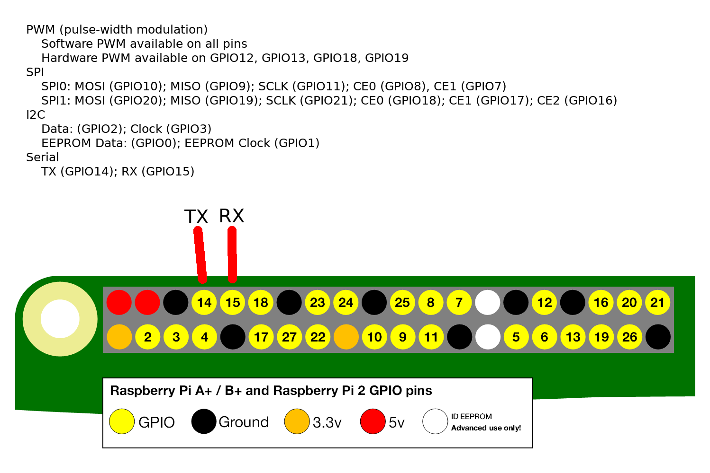

# How to connect through serial port

## What is needed
- a computer
- a serial/usb dongle
- three cables female/female

## Procedure
- add the line "enable_uart=1" in the boot/config.txt file
- connect the RX pin of the usb dongle to the TX pin of the raspberry
- connect the TX pin of the usb dongle to the RX pin of the raspberry
- connect the ground pin of the usb dongle to a ground pin of the raspberry
(No 5v or 3.3V needed)
- connect the serial usb dongle to the computer
- in Linux use the command dmesg to find the device
- with MacOS check the cu.* devices ('ls /dev/cu.*')
- start an terminal emulator on the computer with a baudrate of 115200 
- it is possible to connect to the raspberry

## Terminal emulator software
- With Linux and MacOS: screen
- With Windows: PuTTY (https://putty.org/)

